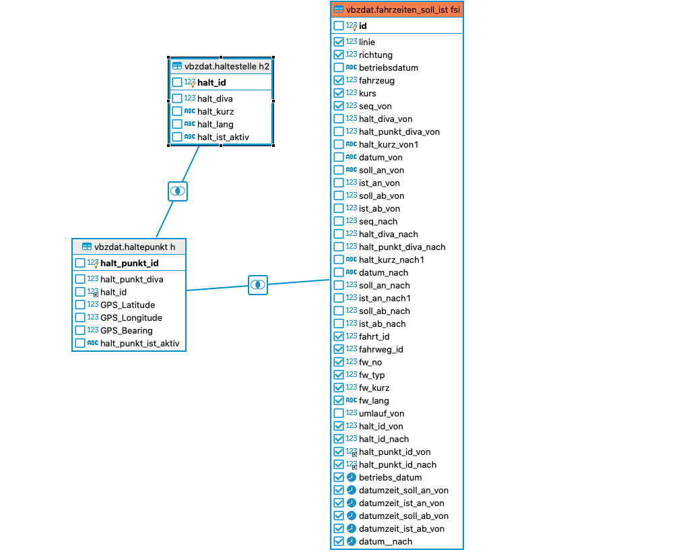
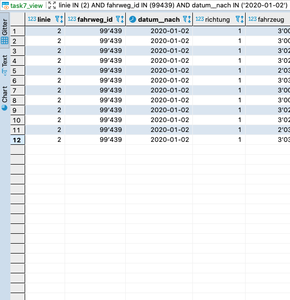
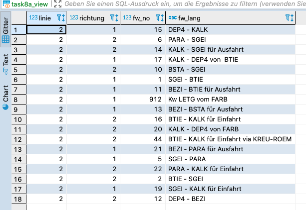
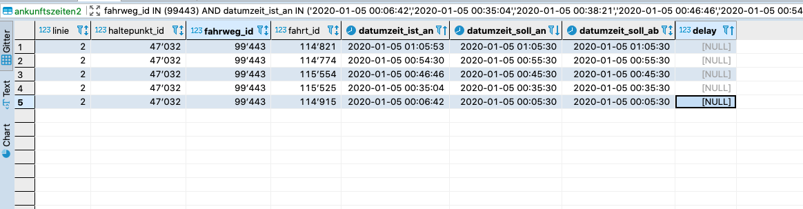
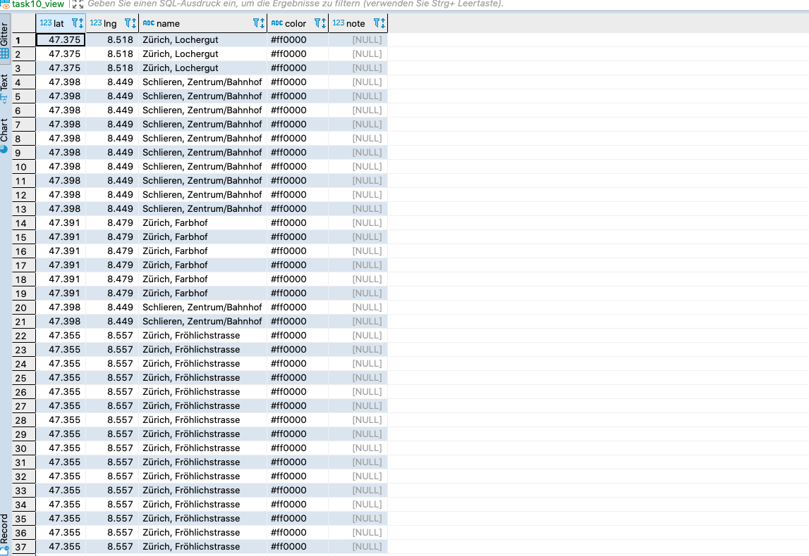
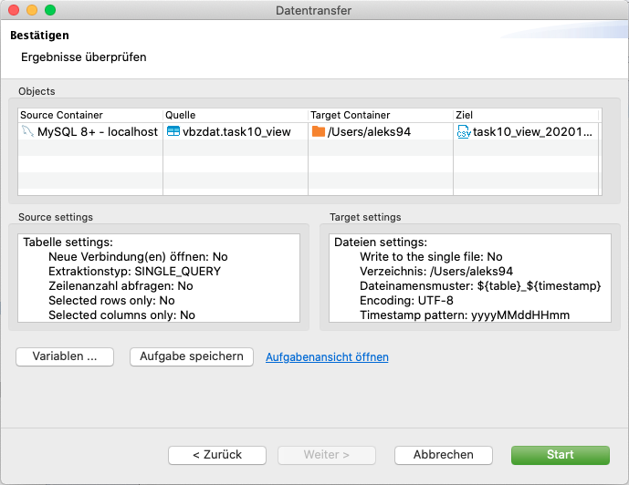
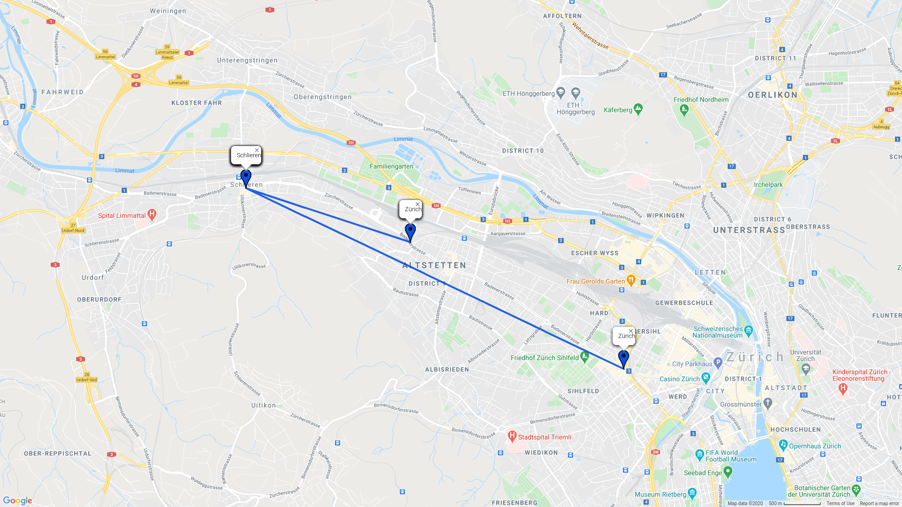
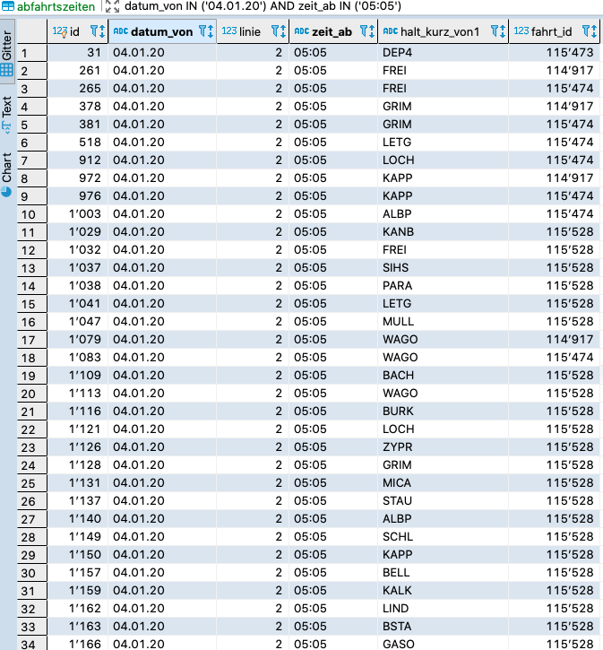
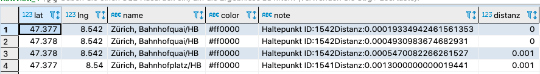

# aleksandar-vbz.dat

Aufgabe 6

Aufgabe 7
[https://github.com/AL-RND/aleksandar-vbz-test/blob/master/code/Task7.sql]

Aufgabe 8
a. [https://github.com/AL-RND/aleksandar-vbz-test/blob/master/code/Task8_a.sql]

b. 

c. [https://github.com/AL-RND/aleksandar-vbz-test/blob/master/code/Task8_c.sql]

Aufgabe 9
a. [https://github.com/AL-RND/aleksandar-vbz-test/blob/master/code/Task9_a.sql]

b. [https://github.com/AL-RND/aleksandar-vbz-test/blob/master/code/Task9_b.sql]

Aufgabe 10

[https://github.com/AL-RND/aleksandar-vbz-test/blob/master/code/Task10.sql]

Aufgabe 11

[https://github.com/AL-RND/aleksandar-vbz-test/blob/master/pictures/Task11.csv]

Aufgabe 12

[https://github.com/AL-RND/aleksandar-vbz-test/blob/master/code/Task12.sql]

Aufgabe 13

[https://github.com/AL-RND/aleksandar-vbz-test/blob/master/code/Task13.sql]

Aufgabe 14

[https://github.com/AL-RND/aleksandar-vbz-test/blob/master/code/Task14.sql]
